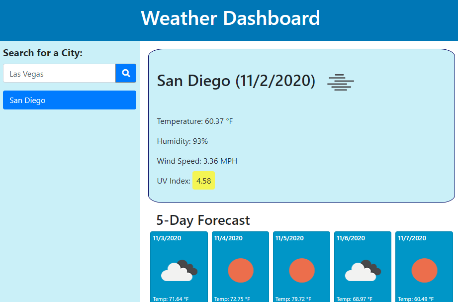

# Weather Checker 🌦️

***

 

## Description

Check the weather for a city!  With this weather dashboard, you will be able to search for a specific city.  Using the OpenWeather APIs, the dashboard will display the current weather condition, temperature, humidity, wind speed, and the UV Index (the UV index will be green if favorable, yellow if moderate, orange if high, and red if severe).  Below this information, a 5-day forecast will display with the predicted weather condition, temperature, and humidity.  In the footer, the OpenWeather icon is a link that will open the OpenWeather site in a new tab.

Please click [here](https://christina2021.github.io/weather-checker/) to use this Weather Checker! 

## Usage

Once the site opens, there will be a Search section.  Cities that were previously searched for will be listed.  Clicking on the city buttons will pull up the current data for that city.

☀️To search for a new city, click into the search field and type in the name of a city.

☀️Once the city name is entered, click on the search button (the magnifying glass).  The page will update with the data for the new city, and the city will also be added as a button (if there was not already an existing button for the city).

☀️The city buttons may be clicked on in order to view the weather again for that specific city.

#### Notes on Usage

🌤️If you enter in a city name that does not exist in OpenWeather, then you will receive an alert regarding this.\
🌤️If you enter in a city in the search field that already is listed from the history, the results will still pull up, but a new button will not be created.\
🌤️Hovering over the weather condition icon will display a description of the weather condition.

## What I Learned 💭

I was able to learn more about API calls while creating this site, as well as obtaining specific pieces of datum to utilize for my site.  It did take a lot of trial-and-errors and console.logs to be able to pull all of the information needed.

## Credits

[OpenWeather-APIs](https://openweathermap.org/api)

## Acknowledgements

Thank you for all of the help and support!
[Brian](https://github.com/btparker70)

## License
[MIT](https://choosealicense.com/licenses/mit/#)